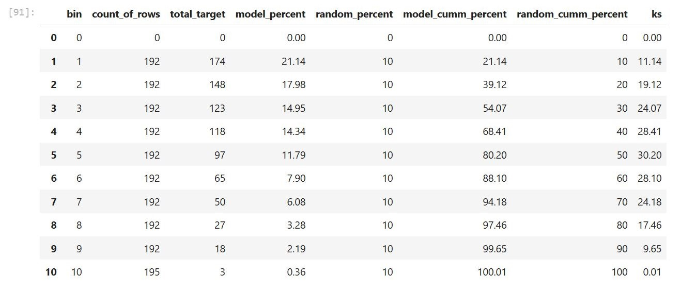

# **Intel NLP Classification Analysis**

## **Overview**
The study aims to predict callers' customer satisfaction by leveraging natural language processing techniques. Developing such a model can help Intel improve satisfaction scores and reduce future expenses associated with manual analysis. Moreover, this model may serve as a foundation for more advanced and effective analytical tools.

---

## **Table of Contents**
- [Project Background](#project-background)
- [Executive Summary](#executive-summary)
- [Insights Deep Dive](#insights-deep-dive)
- [Data Analysis Jupyter Notebooks](#Data-Analysis-Jupyter-Notebooks)
- [Recommendations](#recommendations)
- [Assumptions and Caveats](#assumptions-and-caveats)

---

## **Project Background**
Empowering Intel to proactively identify and engage dissatisfied customers will not only bolster brand reputation but also unlock potential revenue opportunities.

Moreover, integrating machine learning solutions can greatly reduce dependence on expensive and time-intensive surveys conducted by outsourced marketing firms.

This analysis is particularly beneficial for **call center managers and customer experience teams** focused on elevating service quality and boosting customer satisfaction. It provides:

- **Actionable Insights:** The classification model pinpoints critical factors influencing customer satisfaction and highlights specific areas for targeted improvement.
- **Strategic Guidance:** Offers a robust, data-driven framework to optimize call center operations, reduce customer churn, and enhance overall service efficiency.

---

## **Executive Summary**

### **Key Findings**
The analysis reveals that customer reviews do have predictive power to predict customer satisfaction.

- The model demonstrated solid generalization performance, achieving a weighted F1 score of 0.74 on the k-fold training data and 0.76 on unseen test data, indicating effective predictive capability beyond the training set.

- Once finalized, the model's F1 score significantly improves, as it leverages the full vocabulary. This suggests that incorporating additional data will further enhance its predictive performance.

- The model correctly identified 80% of true positives within the first five deciles, making it 1.6 times more effective than random predictions.

---

## **Insights Deep Dive**

### Hypothesis

#### Null Hypothesis (H₀)
There is no predictive relationship between Intel's call center customer reviews and customer satisfaction.

#### Alternative Hypothesis (H₁)
There is a predictive relationship between Intel's call center customer reviews and customer satisfaction, meaning that call center reviews have a significant impact on predicting whether a customer is satisfied or not.

#### Experiment Results
We reject H₀ (null hypothesis) as the classification model has proven that there is a predictive relationship between Intel's call center customer reviews and customer satisfaction.

### **Cumulative Accuracy Profile (CAP) Insights**

The CAP curve visually illustrates the NLP classification model’s effectiveness in identifying dissatisfied customers:

- The **classifier** (blue line) significantly outperforms the **random model** (red dashed line), highlighting its predictive strength.
- A robust **KS statistic of 50%** indicates strong differentiation between dissatisfied and satisfied callers, confirming the model's capability to effectively differentiate between classes.

### **Key Performance Highlights**

- **Efficient Early Identification:**  
  The classifier identifies approximately **80%** of dissatisfied customers within the first five deciles. This demonstrates a considerable advantage, allowing Intel to efficiently prioritize resources.

- **Top-Decile Performance:**  
  The highest-performing decile alone captures **21%** of dissatisfied customers, more than double the rate of random selection (10%), underscoring the model's precision.

### **Interpretation**
- The KS statistic peaks at the **5th decile (30.20%)**, representing the optimal differentiation between dissatisfied and satisfied customers.
- Model accuracy naturally diminishes in the lower deciles, emphasizing the importance of prioritizing top-ranked predictions.

---

## **Data Analysis Jupyter Notebooks**
- [Intel NLP Preprocessing & EDA](./Intel_NLP_Preprocessing_EDA.ipynb)  
- [Intel NLP Classification Analysis](./Intel_NLP_Classification_Analysis.ipynb)  

---

## **Recommendations**

### **1. Enhance NLP Model with Additional Data**  
- Incorporate a larger and more diverse dataset to improve the model's vocabulary coverage and predictive accuracy.
- Continuously update the training dataset with recent customer interactions to maintain model relevance.

### **2. Prioritize High-Risk Customers**
- Utilize model predictions to proactively identify dissatisfied callers early in the interaction process.
- Implement targeted intervention strategies such as follow-up calls or specialized training for call center agents handling high-risk interactions.

### **3. Optimize Resource Allocation**
- Direct attention and resources towards the top-performing deciles identified by the model to maximize customer satisfaction outcomes.

### **4. Continuous Monitoring and Model Refinement**
- Regularly evaluate the model's performance metrics (e.g., F1 score, KS statistic) to identify opportunities for further improvement.
- Integrate real-time feedback loops where caller feedback and model predictions continually enhance model effectiveness and accuracy.

### **5. Leverage Insights for Training Programs**
- Translate predictive insights into actionable training materials for customer service representatives, addressing recurring themes linked to dissatisfaction.
- Foster an ongoing improvement culture within call center teams by aligning performance metrics with model-driven insights.

---

## **Assumptions and Caveats**  

- **Quality and Representativeness of Data:**
  - The accuracy and generalization of the NLP model are highly dependent on the quality, completeness, and representativeness of the training data. Any biases or gaps in the data can adversely impact predictions.

---

## **Final Thoughts**
This NLP classification analysis demonstrates that leveraging textual customer reviews provides predictive insights into customer satisfaction. Intel can utilize this predictive power strategically to optimize customer service operations, enhance customer experience, and reduce costs associated with manual feedback analysis. Investing in continuous model improvement and integration into operational workflows will ensure sustained benefits and competitive advantage.

🚀 *Empowering customer satisfaction through advanced NLP analytics.*

